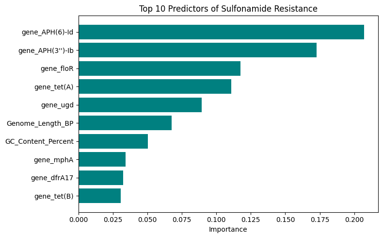
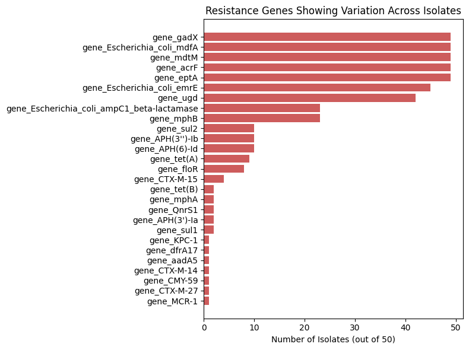

# Antibacterial Resistance Pattern Analysis and Machine Learning Prediction in *Escherichia coli* Using Public Genomic Data

## Background
Antimicrobial resistance (AMR) is recognized by the World Health Organization as one of the top global health threats. During my BSc in Microbiology, I conducted research on antibacterial resistance patterns. This project extends that work into a data science and machine learning context, using publicly available genomic surveillance data.

## Objective
To analyze antibacterial resistance gene patterns in *E. coli* isolates and build a machine learning model to predict sulfonamide resistance based on genomic features and co-occurring resistance genes.

## Dataset
- Source: Kaggle AMR (Antimicrobial Resistance) Dataset, derived from public *E. coli* genome submissions (NCBI)
- 50 *E. coli* isolates, 112 features (genome length, GC content, presence/absence of 80+ resistance genes, and derived drug-class resistance labels)
- One isolate's data is traceable to a peer-reviewed publication (Kawano et al., *Antibiotics (Basel)* 14(4), 360, 2025)
- **Data acknowledgment:** all data used is publicly available and was not collected by the author. Credit belongs to the original dataset contributor and the genome submitters on NCBI. Used here strictly for independent educational/portfolio analysis.

## Methods
1. Exploratory analysis to identify resistance genes that vary across isolates (excluding genes universally present or absent)
2. Sanity check confirming `class_sulfonamide` is directly derived from `gene_sul1`/`gene_sul2` presence
3. Built a Random Forest classifier to predict sulfonamide resistance using genome length, GC content, and other resistance genes — deliberately excluding sul1/sul2 to avoid a trivial prediction
4. Evaluated using Leave-One-Out Cross-Validation, appropriate given the small sample size (n=50)

## Key Findings
- Model achieved **94% accuracy** (47/50 correct), compared to a 78% baseline from simply predicting the majority class
- The strongest predictors of sulfonamide resistance were aminoglycoside resistance genes (APH(6)-Id, APH(3'')-Ib), florfenicol resistance (floR), and tetracycline resistance (tet(A)) — not genomic traits like length or GC content

- This suggests sulfonamide resistance tends to co-occur with resistance to unrelated drug classes, consistent with known co-selection of resistance genes carried together on mobile genetic elements (plasmids)

## Limitations
This analysis uses a small sample (n=50), so results should be interpreted as illustrative of gene co-occurrence patterns rather than generalizable clinical predictions. A larger, more diverse dataset would be needed for robust conclusions.

## Tech Stack
Python, pandas, scikit-learn, matplotlib, Google Colab

## How to Run
1. Open `Copy_of_amr_resistance_analysis.ipynb` in Google Colab
2. Upload the dataset when prompted
3. Run all cells in order
